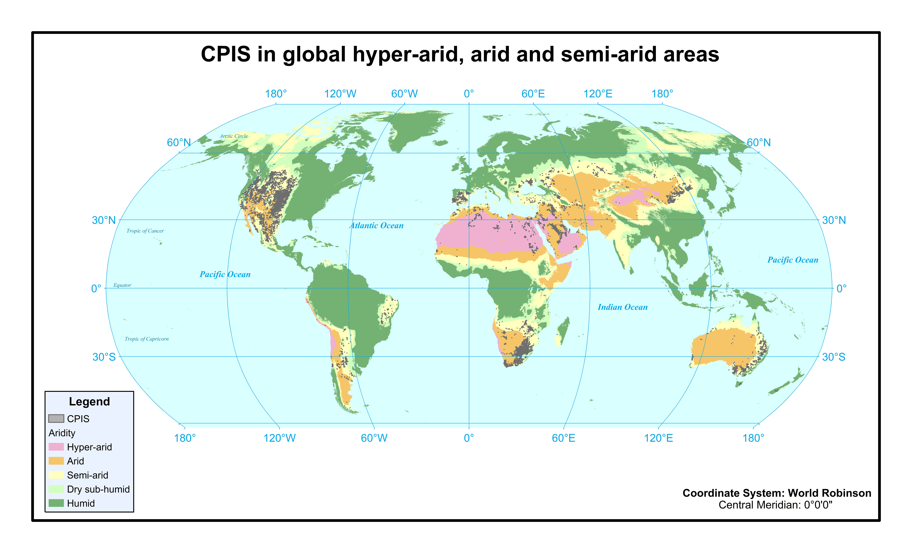

# global_cpis_shp
World_CPIS_2000.zip: CPIS in global arid areas in 2000 (unzip to obtain the shp file) 

World_CPIS_2021.zip: CPIS in global arid areas in 2021 (unzip to obtain the shp file)
   
   
All rights reserved.
 
 
Future updates will be implemented. If you use our data, please cite our paper:

Chen, F., Zhao, H., Roberts, D., Van de Voorde, T., Batelaan, O., Fan, T., Xu, W., Mapping center pivot irrigation systems in global arid regions using instance segmentation and analyzing their spatial relationship with freshwater resources, Remote Sensing of Environment. (accepted).
 
 
For more information, please contact Fen Chen: chenfen@uestc.edu.cn
