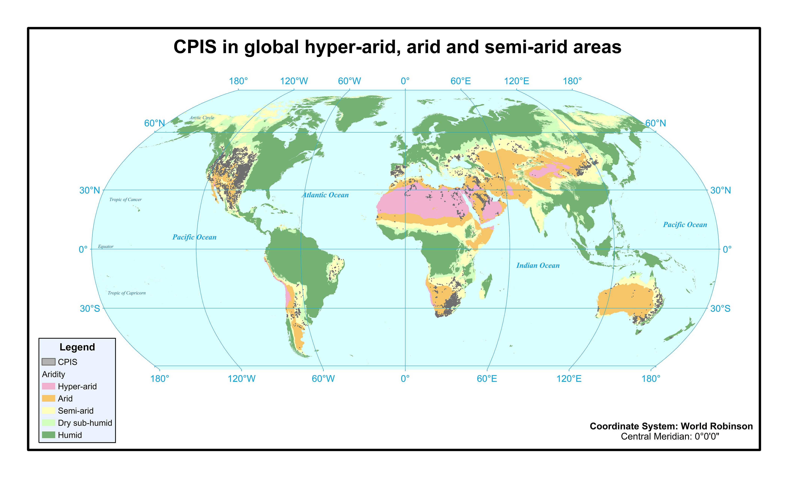

# global_cpis_shp
World_CPIS_2000.zip: CPIS in global arid areas in 2000 (unzip to obtain the shp file) 

World_CPIS_2021.zip: CPIS in global arid areas in 2021 (unzip to obtain the shp file)
   
   
Note that, the World_CPIS_2021.zip data was updated in 2024/6/13. In this new version, some missed CPIS were added and some false detections were removed. We would like to thank for the helpful feedback from the users.

Future updates will be implemented.
   
**All rights reserved.**
 
 

If you use our data, please cite our paper:
Chen, F., Zhao, H., Roberts, D., Van de Voorde, T., Batelaan, O., Fan, T. and Xu, W., 2023. Mapping center pivot irrigation systems in global arid regions using instance segmentation and analyzing their spatial relationship with freshwater resources. Remote Sensing of Environment, 297, p.113760.
 
 
For more information, please contact Fen Chen: chenfen@uestc.edu.cn
